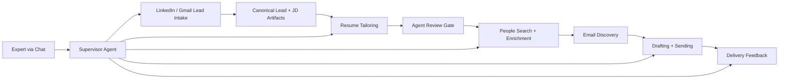

# Job Hunt Copilot v4

An autonomous, spec-first job-search system designed to:
- ingest role leads from LinkedIn-style alerts
- tailor a resume to a specific posting
- find internal contacts
- draft and send targeted outreach
- observe delivery outcomes
- operate through a dedicated supervisor agent

## Why This Repo Exists

This repository is the fourth-generation design and build workspace for a serious agentic software project.

The goal is not just to "send job emails."
The goal is to build a reliable autonomous workflow with:
- durable state
- strict handoff contracts
- auditability
- bounded repair and escalation
- human-overseeable control planes

## Current Status

This repo is currently in a **spec-complete, implementation-starting** phase.

What already exists:
- a detailed product specification in [prd/spec.md](./prd/spec.md)
- an acceptance spec in [prd/test-spec.feature](./prd/test-spec.feature)
- an autonomous operations-agent design
- an unattended multi-agent build system scaffold under [build-agent/](./build-agent/)

What is still in progress:
- core runtime implementation of the actual product components

## System Overview



A more detailed view is in [docs/ARCHITECTURE.md](./docs/ARCHITECTURE.md).

## Why It Is Interesting

From a software-engineering perspective, this project is about:
- translating a complex operational workflow into explicit state machines
- using artifact contracts instead of vague agent memory
- separating a runtime ops agent from a build agent
- designing bounded autonomy instead of uncontrolled automation
- building systems that can recover, explain themselves, and be reviewed

## Repository Map

```text
.
├── prd/          Product spec and acceptance spec
├── build-agent/  Long-run Codex build control plane
├── docs/         Human-readable architecture and repo explanation
├── assets/       Source assets for tailoring and outreach
└── secrets/      Local runtime secrets (ignored from git)
```

## Key Documents

- [Product Specification](./prd/spec.md)
- [Acceptance Specification](./prd/test-spec.feature)
- [Architecture Overview](./docs/ARCHITECTURE.md)
- [Agent Autonomy Q&A](./docs/agent-autonomy-qna.md)
- [Build Agent Guide](./build-agent/README.md)

## For Recruiters And Engineering Managers

If you want the shortest path through this repo:
1. read this file
2. open [docs/ARCHITECTURE.md](./docs/ARCHITECTURE.md)
3. skim [prd/spec.md](./prd/spec.md) for the system depth
4. inspect [build-agent/](./build-agent/) for how the build itself is being automated

The most important engineering ideas here are:
- spec-first development
- agentic control planes with safety boundaries
- explicit operational state
- human-reviewable autonomous systems

## Build Philosophy

This repository is intentionally being built in a way that is itself part of the project:
- the runtime product has an autonomous supervisor-agent design
- the implementation process also has a long-run Codex build agent
- both are designed around durable state, fresh-session recovery, and bounded work units

## Notes

- Local secrets are intentionally excluded from version control.
- Generated runtime state for the build agent is intentionally excluded from version control.
- This README is meant to stay concise and navigable; deeper detail belongs in the linked docs.
