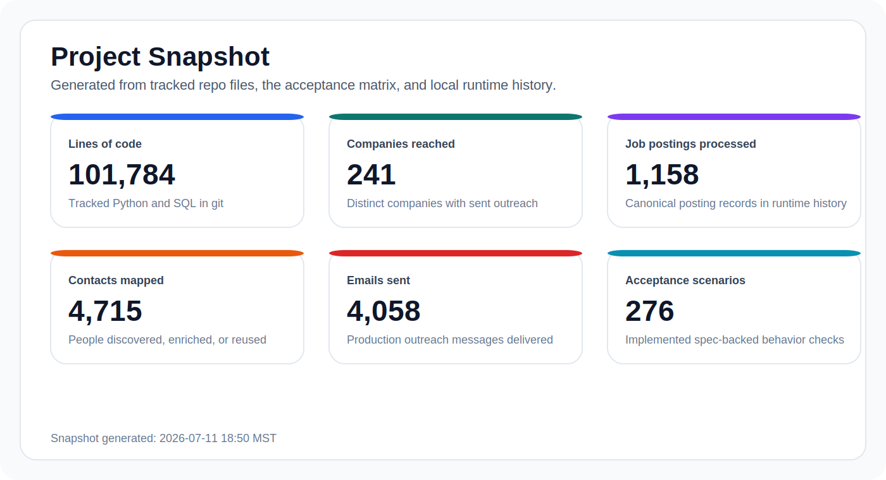
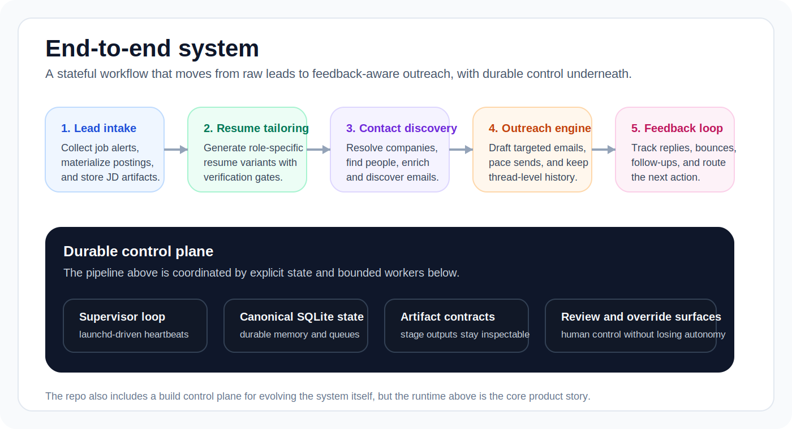
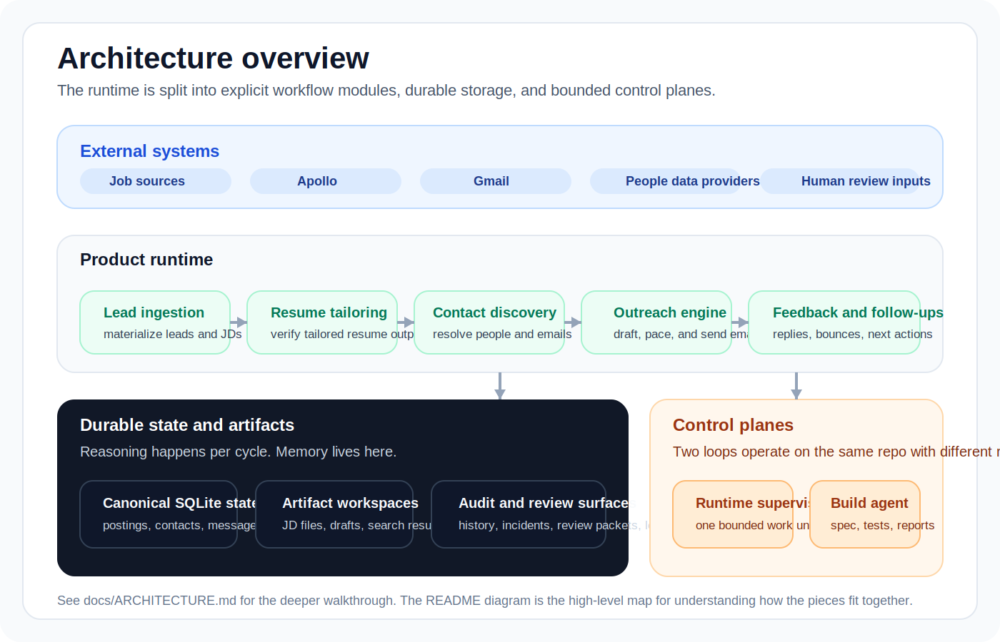

# Job Hunt Copilot v4

> A stateful AI workflow that turns job leads into tailored resumes, contact discovery, targeted outreach, and reply-aware follow-ups.



Job Hunt Copilot v4 is built as an operating system for a narrow workflow, not as a one-shot prompt demo.
It ingests leads, materializes artifacts, runs bounded background workers, keeps durable state in SQLite, and leaves an inspectable audit trail for every important step.

This repository contains two connected systems:
- the product runtime that executes the lead-to-outreach workflow
- the build control plane used to evolve and validate the product itself

## What the runtime does

- Collects job leads and turns them into canonical posting and JD artifacts
- Generates role-specific resume variants with verification gates
- Finds internal contacts, enriches them, and discovers work emails
- Drafts and sends paced outreach with durable message history
- Tracks replies, bounces, and follow-ups as first-class workflow stages

## End-to-end system



## Architecture



The project is organized around four explicit layers:
- **External systems:** job sources, Apollo, Gmail, and review inputs provide signals, recipients, and delivery outcomes.
- **Product runtime:** lead ingestion, tailoring, contact discovery, outreach, and follow-up are separate modules with explicit handoffs.
- **Durable state and artifacts:** SQLite stores canonical workflow state while stage workspaces persist inspectable files like JDs, drafts, search results, and feedback artifacts.
- **Control planes:** the launchd-driven supervisor advances the runtime one bounded unit at a time, while the build control plane evolves the product through spec, acceptance coverage, and validation reports.

The core design choice is that the model is used for reasoning, not for memory. Memory lives in canonical state, artifacts, and audit history.

## Why this project reads differently

| Typical AI demo | Job Hunt Copilot v4 |
| --- | --- |
| One prompt chain | Multi-stage runtime with explicit state transitions |
| Ephemeral chat memory | SQLite-backed queues, artifacts, and audit history |
| Ad hoc scripts | Scheduled workers, pacing, retries, and review gates |
| Output only | Delivery feedback and follow-up loops built into the system |
| Lightweight README claims | Spec, acceptance matrix, runtime history, and test coverage |

## What makes it technically interesting

- **Durable autonomy:** the system keeps its own memory in canonical state, not in model context windows.
- **Spec-first development:** behavior is driven by product rules and acceptance scenarios before implementation details.
- **Bounded control planes:** workers do one safe unit of work at a time and persist every result, pause, or escalation.
- **Real workflow pressure:** this repo is built around actual operational concerns like retries, pacing, thread safety, reviewability, and failure recovery.

## Snapshot notes

The metric cards at the top of this README emphasize shipped workflow scale, engineering depth, and validation coverage. They are generated from:
- runtime history in `job_hunt_copilot.db`
- the acceptance trace matrix in `build-agent/reports/`
- tracked repo code statistics for the accompanying JSON snapshot

Refresh them with:

```bash
python3 scripts/ops/generate_readme_metrics.py
```

The generated assets live in:
- [`assets/readme/project-snapshot.svg`](./assets/readme/project-snapshot.svg)
- [`assets/readme/project-snapshot.json`](./assets/readme/project-snapshot.json)

## Repository guide

| Path | Purpose |
| --- | --- |
| [`job_hunt_copilot/`](./job_hunt_copilot/) | Core runtime: ingestion, tailoring, discovery, outreach, feedback, supervisor control |
| [`prd/spec.md`](./prd/spec.md) | Product contract and system rules |
| [`prd/test-spec.feature`](./prd/test-spec.feature) | Acceptance behavior in executable-spec form |
| [`docs/ARCHITECTURE.md`](./docs/ARCHITECTURE.md) | Fast technical walkthrough of the system |
| [`build-agent/`](./build-agent/) | Build control plane and validation reports |
| [`tests/`](./tests/) | Regression and workflow coverage |
| [`assets/`](./assets/) | Prompting, outreach, and resume-tailoring source assets |

## Good places to start

1. Read [docs/ARCHITECTURE.md](./docs/ARCHITECTURE.md) for the system walkthrough.
2. Open [prd/spec.md](./prd/spec.md) to see the product depth and operating model.
3. Inspect [build-agent/reports/repo-readiness-summary.md](./build-agent/reports/repo-readiness-summary.md) for the implementation snapshot.
4. Review [build-agent/reports/ba-10-acceptance-trace-matrix.md](./build-agent/reports/ba-10-acceptance-trace-matrix.md) for the spec-to-code evidence trail.

## Notes

- Local secrets are excluded from version control.
- Runtime artifacts under `ops/` are intentionally noisy and are not the best first entry point.
- The README is now optimized for quick comprehension; deeper implementation detail lives in the linked docs and reports.
