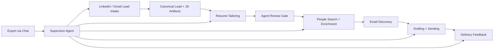

# Job Hunt Copilot v4

An autonomous, spec-first job-search system designed to:
- ingest role leads from LinkedIn-style alerts
- tailor a resume to a specific posting
- find internal contacts
- draft and send targeted outreach
- observe delivery outcomes
- operate through a dedicated supervisor agent

## Why This Repo Exists

This repository is the fourth-generation design and build workspace for a serious agentic software project.

The goal is not just to "send job emails."
The goal is to build a reliable autonomous workflow with:
- durable state
- strict handoff contracts
- auditability
- bounded repair and escalation
- human-overseeable control planes

## Current Status

This repo is currently in a **spec-complete, implementation-underway** phase.

What already exists:
- a detailed product specification in [prd/spec.md](./prd/spec.md)
- an acceptance spec in [prd/test-spec.feature](./prd/test-spec.feature)
- an autonomous operations-agent design
- an unattended multi-agent build system scaffold under [build-agent/](./build-agent/)
- a foundation runtime bootstrap package for support-directory setup, secret materialization, and DB migration scaffolding
- a canonical SQLite schema migration set with review views plus shared ID and timestamp helpers for downstream components
- shared artifact publication helpers for YAML/JSON contracts, canonical workspace path building, and `artifact_records` registration
- supervisor control-plane persistence helpers for canonical control state, pipeline runs, supervisor cycles, and runtime leases
- a bounded supervisor cycle executor with incident-aware work selection, cycle snapshots, lease-guarded single-flight execution, and auto-pause or escalation handling for unsupported progression
- persisted expert review packets, expert review decisions, and override audit events with filesystem review-packet artifacts under `ops/review-packets/`
- a generated product-side runtime pack under `ops/agent/` with identity, policy, action-catalog, service-goal, escalation, progress-log, ops-plan, and bootstrap prompt surfaces
- repo-local launchd wiring under `ops/launchd/` plus `bin/jhc-agent-start`, `bin/jhc-agent-stop`, `bin/jhc-agent-cycle`, `bin/jhc-feedback-sync-cycle`, and `bin/jhc-chat` for local heartbeat, delayed feedback polling, and operator control, with `jhc-chat` now printing a persisted clean-first startup dashboard plus grouped review snapshot before Codex opens
- the manual-ingestion and materialization slices under `job_hunt_copilot.linkedin_scraping`, including `bin/jhc-linkedin-ingest`, canonical lead workspace creation, `capture-bundle.json`, deterministic `post.md` / `jd.md` / `poster-profile.md` derivation, `source-split.yaml`, `source-split-review.yaml`, blocked-or-ready `lead-manifest.yaml` publication, canonical `job_postings` / poster-contact link creation for reviewed manual leads, and refresh-in-place history snapshotting under each lead workspace `history/`
- the current Gmail-intake slices under `job_hunt_copilot.gmail_alerts` and `job_hunt_copilot.linkedin_scraping`, including `jhc-linkedin-ingest gmail-batch`, persisted collected-email units under `linkedin-scraping/runtime/gmail/{received_at}-{gmail_message_id}/`, plain-text-first multi-card parsing with HTML fallback only when needed, zero-card review-threshold metadata retained in `email.json`, normalized-URL fallback dedupe when `job_id` is missing, and autonomous per-card lead fan-out into canonical lead workspaces with merged canonical `jd.md`, `alert-email.md`, `alert-card.json`, `jd-fetch.json`, `lead-manifest.yaml`, and honest `incomplete`, review-blocked, or `blocked_no_jd` lead state
- the current Resume Tailoring runtime under `job_hunt_copilot.resume_tailoring`, including `job_posting_id`-rooted eligibility evaluation from persisted `jd.md`, application-local `applications/{company}/{role}/eligibility.yaml` audit artifacts, honest `hard_ineligible` posting short-circuiting, active `resume_tailoring_runs` bootstrap or reuse, per-posting workspace materialization under `resume-tailoring/output/tailored/{company}/{role}/`, shared-contract `meta.yaml`, mirrored `jd.md` / optional `post.md` / `poster-profile.md`, working `resume.tex`, `scope-baseline.resume.tex`, deterministic Step 3 through Step 7 intelligence artifacts, scope-guarded Step 6 apply, compile-safe finalize into `Achyutaram Sonti.pdf`, one-page verification, persisted mandatory review decisions under `resume-tailoring/output/tailored/<company>/<role>/review/<run_id>/`, direct `resume_review_pending -> approved|rejected` run transitions, posting handoff into `requires_contacts` or `ready_for_outreach`, owner override lineage in `override_events`, and snapshot-backed retailoring history across multiple runs
- the completed Outreach discovery epic under `job_hunt_copilot.email_discovery`, including DB-first bootstrap from approved `requires_contacts` postings, Apollo-first company resolution plus broad people search, persisted `discovery/output/{company}/{role}/people_search_result.json` artifacts, shortlist selection capped to the current 6-contact policy across recruiter, manager-adjacent, and engineer buckets, shortlist-time canonical `contacts` / `job_posting_contacts` materialization with `identified -> shortlisted` link promotion for reused contacts, selective Apollo enrichment only for shortlisted contacts that still need fuller identity or usable emails, optional `recipient_profile.json` capture under `discovery/output/{company}/{role}/recipient-profiles/{contact_id}/`, person-scoped `prospeo -> getprospect -> hunter` email discovery with working-email reuse plus feedback-aware bounce retry handling that no longer auto-clears contact email state, persisted `discovery_result.json` handoff artifacts plus `discovery_attempts`, `provider_budget_state`, and `provider_budget_events`, dead-end shortlist cleanup for unusable sparse contacts, unresolved or exhausted review visibility through the canonical SQLite views, and the contact-level readiness data that now feeds the BA-08 send-set planner
- the current Drafting and Sending runtime under `job_hunt_copilot.outreach`, including DB-first role-targeted send-set assembly across recruiter, manager-adjacent, engineer, and fallback contacts, honest `requires_contacts` versus `ready_for_outreach` evaluation based on the full currently selected send set, repeat-outreach review exclusion from the automatic set, queryable company pacing plus randomized inter-send-gap calculations, deterministic role-targeted and general-learning draft generation, per-message `outreach_messages` persistence with final subject/body plus rendered HTML, draft-triggered `outreach_in_progress` state transitions for postings and linked contacts, stable `messages/<outreach_message_id>/email_draft.md` plus `send_result.json` artifacts under `outreach/output/`, root-level `email_draft.md` / `send_result.json` mirrors for the active role-targeted workspace, and paced send execution that persists canonical `sent_at` plus thread or delivery identifiers while blocking automatic repeat-outreach or ambiguous resend cases instead of double-sending
- the completed Delivery Feedback and review-surface epic under `job_hunt_copilot.delivery_feedback` and `job_hunt_copilot.review_queries`, including reusable immediate or delayed mailbox polling over canonical sent-message records, `feedback_sync_runs` audit rows, exact-message `delivery_feedback_events` persistence for `bounced`, `not_bounced`, and `replied` outcomes, logical-event dedupe for repeated mailbox ingestion, per-event `delivery_outcome.json` artifacts under each message workspace plus root-level latest mirrors, a grouped read-only review snapshot over postings, contacts, sent messages, unresolved discovery, incidents, and expert review packets, a queryable delivery-feedback reuse surface that keeps bounced and `not_bounced` signals available to discovery while replies stay review-only, outstanding blocked/failed/repeat-outreach review-item queries with artifact-backed reason recovery, override history retrieval, and per-object traceability over artifacts, state transitions, and downstream records
- the current BA-10 quality layer under `build-agent/reports/` and `scripts/quality/`, including the committed acceptance trace matrix, blocker audit, latest validation-suite report snapshot, smoke harness, and a reproducible `run_ba10_validation_suite.py` entrypoint for the automated hardening checks

What is still in progress:
- BA-10 hardening is not fully closed yet: the remaining explicit acceptance gaps are autonomous maintenance workflow or artifacts, richer `jhc-chat` review and control behavior, idle-timeout auto-resume after unexpected chat exit, and posting-abandon control
- those open gaps are tracked explicitly in `build-agent/reports/ba-10-acceptance-trace-matrix.md`, `build-agent/reports/ba-10-blocker-audit.md`, and `build-agent/reports/ba-10-validation-suite-latest.md` rather than being hidden behind a generic "in progress" label

## System Overview



A more detailed view is in [docs/ARCHITECTURE.md](./docs/ARCHITECTURE.md).

## Why It Is Interesting

From a software-engineering perspective, this project is about:
- translating a complex operational workflow into explicit state machines
- using artifact contracts instead of vague agent memory
- separating a runtime ops agent from a build agent
- designing bounded autonomy instead of uncontrolled automation
- building systems that can recover, explain themselves, and be reviewed

## Repository Map

```text
.
├── prd/          Product spec and acceptance spec
├── job_hunt_copilot/  Product runtime bootstrap, schema, and persistence scaffolding
├── build-agent/  Long-run Codex build control plane
├── docs/         Human-readable architecture and repo explanation
├── assets/       Source assets for tailoring and outreach
├── tests/        Bootstrap and runtime validation
└── secrets/      Local runtime secrets (ignored from git)
```

## Key Documents

- [Product Specification](./prd/spec.md)
- [Acceptance Specification](./prd/test-spec.feature)
- [Architecture Overview](./docs/ARCHITECTURE.md)
- [Agent Autonomy Q&A](./docs/agent-autonomy-qna.md)
- [Build Agent Guide](./build-agent/README.md)

## For Recruiters And Engineering Managers

If you want the shortest path through this repo:
1. read this file
2. open [docs/ARCHITECTURE.md](./docs/ARCHITECTURE.md)
3. skim [prd/spec.md](./prd/spec.md) for the system depth
4. inspect [build-agent/](./build-agent/) for how the build itself is being automated

The most important engineering ideas here are:
- spec-first development
- agentic control planes with safety boundaries
- explicit operational state
- human-reviewable autonomous systems

## Build Philosophy

This repository is intentionally being built in a way that is itself part of the project:
- the runtime product has an autonomous supervisor-agent design
- the implementation process also has a long-run Codex build agent
- both are designed around durable state, fresh-session recovery, and bounded work units

## Notes

- Local secrets are intentionally excluded from version control.
- Generated runtime state for the build agent is intentionally excluded from version control.
- This README is meant to stay concise and navigable; deeper detail belongs in the linked docs.
