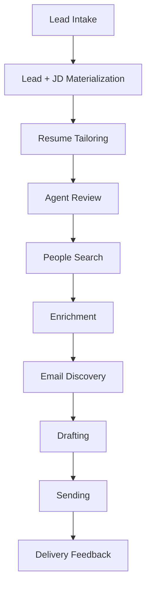
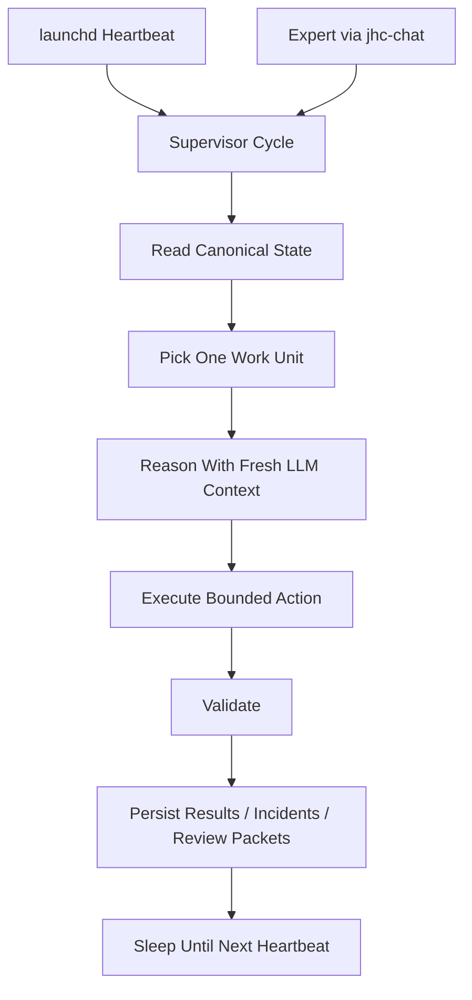
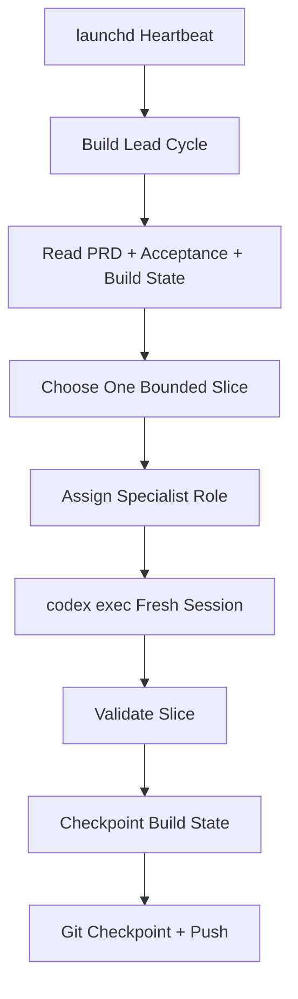
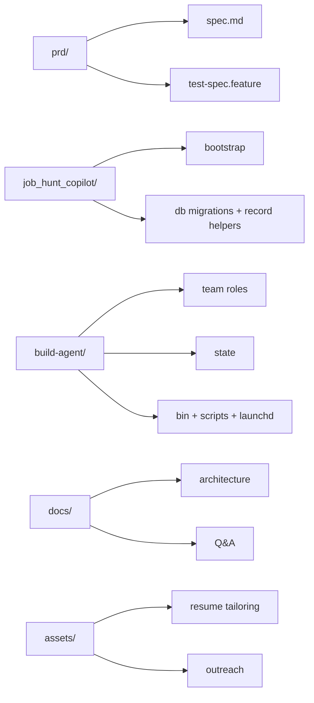

# Architecture Overview

This document is the quickest technical walkthrough of the repository.

For the full contract, see [prd/spec.md](../prd/spec.md).

## Big Picture

Job Hunt Copilot v4 is designed as two related systems:

1. the **product runtime**
   - ingests leads
   - tailors resumes
   - finds people
   - sends outreach
   - tracks delivery outcomes

2. the **control planes**
   - the **operations / supervisor agent** that runs the product
   - the **build agent** that helps implement the product itself

## Product Flow

## Runtime Control Plane

Key design choice:
- the LLM is not the memory
- SQLite state, artifacts, and logs are the memory

## Build Control Plane

Key design choice:
- the build team thinks in multiple roles
- unattended execution stays serialized by default
- one primary slice per cycle keeps repo changes understandable

## Data And Artifact Philosophy

This repository prefers:
- explicit artifacts over hidden memory
- state transitions over vague narrative progress
- machine-readable handoffs plus human-readable companion files

The product runtime now has an explicit bootstrap layer under `job_hunt_copilot/`:
- repo-path helpers for the current-build layout
- canonical DB migrations and review views for `job_hunt_copilot.db`
- shared canonical ID and lifecycle timestamp helpers for downstream records
- shared artifact contract writers and `artifact_records` registration helpers
- supervisor control-state helpers for `agent_control_state`, `pipeline_runs`, `supervisor_cycles`, and `agent_runtime_leases`
- a bounded supervisor cycle executor that acquires the canonical lease, selects one work unit, persists a context snapshot, and records auto-pause or escalation outcomes through canonical incidents
- expert review packet generation under `ops/review-packets/`, canonical `expert_review_packets` and `expert_review_decisions`, and override audit history through `override_events`
- generated runtime self-awareness artifacts under `ops/agent/` for identity, policies, action catalog, service goals, escalation policy, progress log, ops plan, and bootstrap prompts
- local launchd materialization under `ops/launchd/` plus repo-local `jhc-agent-start`, `jhc-agent-stop`, `jhc-agent-cycle`, `jhc-feedback-sync-cycle`, and `jhc-chat` wrappers for start/stop, one-shot heartbeat execution, recurring delayed-feedback polling, and the expert chat entrypoint
- canonical chat-session bookkeeping that records active-session state, pauses autonomous work on chat open, resumes on clean explicit close while preserving non-chat pause conditions, and now materializes a persisted clean-first startup dashboard plus grouped review snapshot from canonical state for `jhc-chat`
- bootstrap checks for assets and local secret materialization
- repo-local runtime directory creation for downstream components
- manual LinkedIn intake helpers that ingest `paste/paste.txt` or browser-style capture bundles into canonical lead workspaces, persist `capture-bundle.json`, and register the lead raw-source artifact in canonical state
- a deterministic manual-lead split pipeline that derives `post.md`, `jd.md`, and `poster-profile.md` when evidence exists, writes `source-split.yaml` plus `source-split-review.yaml`, and publishes a blocked-or-ready `lead-manifest.yaml` for manual leads
- manual lead materialization helpers that create canonical `job_postings`, poster `contacts`, `linkedin_lead_contacts`, and `job_posting_contacts`, then upgrade `lead-manifest.yaml` with created entity ids plus `resume_tailoring` handoff readiness
- refresh-in-place manual lead updates that replace the live source workspace while snapshotting prior source or review artifacts under each lead-local `history/` directory for auditability
- Gmail alert intake helpers that persist `email.md`, `email.json`, and `job-cards.json` under `linkedin-scraping/runtime/gmail/`, prefer the plain-text LinkedIn digest for multi-card parsing, fall back to HTML-derived text only when the plain-text body is unusable, retain zero-card threshold metadata for later review surfaces, dedupe by `job_id` or normalized LinkedIn job URL fallback, merge multiple JD candidates into canonical `jd.md` with LinkedIn conflict precedence, and fan out parsed cards into canonical lead workspaces with `alert-email.md`, `alert-card.json`, `jd-fetch.json`, `lead-manifest.yaml`, plus honest review-blocked or `blocked_no_jd` handoff state when identity or JD recovery issues remain
- Resume Tailoring eligibility, lifecycle, workspace-bootstrap, intelligence-generation, finalize, and mandatory-review helpers that evaluate the persisted posting-linked `jd.md`, write `applications/{company}/{role}/eligibility.yaml`, register that artifact in canonical metadata, mark hard-ineligible postings honestly, create or reuse the active `resume_tailoring_runs` row, materialize the per-posting workspace with `meta.yaml`, mirrored context files, `resume.tex`, `scope-baseline.resume.tex`, and Step 3 through Step 7 artifacts, generate deterministic JD-signal and evidence-mapping outputs from the persisted `jd.md` plus master profile, enforce scope against the baseline snapshot before apply, compile `Achyutaram Sonti.pdf`, verify one-page output with `pdfinfo`, persist mandatory review decisions as first-class artifacts, transition approved runs into `requires_contacts` or `ready_for_outreach`, record owner overrides with prior-decision context in `override_events`, and snapshot prior run workspaces before retailoring so historical run rows keep immutable references
- completed discovery helpers under `job_hunt_copilot.email_discovery` that bootstrap strictly from approved `requires_contacts` postings, resolve Apollo company identity when available, run a broad company-scoped people search, persist `people_search_result.json` with the full candidate list and applied filters, cap the first enrichment shortlist at 6 contacts across recruiter, manager-adjacent, and engineer buckets, materialize canonical shortlist contacts plus `job_posting_contacts` only for the selected candidates while promoting reused `identified` links into `shortlisted`, selectively enrich only those shortlisted contacts that still need clearer identity or usable emails, persist optional LinkedIn-backed `recipient_profile.json` snapshots under `discovery/output/{company}/{role}/recipient-profiles/{contact_id}/`, run contact-scoped `prospeo -> getprospect -> hunter` email discovery with working-email reuse plus delivery-feedback-aware bounce retry rules that do not auto-clear contact email state, persist `discovery_result.json` plus canonical `discovery_attempts`, `provider_budget_state`, and `provider_budget_events`, and surface unresolved or exhausted cases through the existing SQLite review views while feeding the later send-set planner with grounded contact-readiness state
- a shared outreach runtime under `job_hunt_copilot.outreach` that now evaluates the active role-targeted send set from canonical posting, contact, and prior-message history, prefers recruiter plus manager-adjacent plus engineer coverage when available, excludes repeat-outreach cases from the automatic send set, keeps postings in `requires_contacts` until every currently selected contact is actually send-ready, computes queryable company-cap plus randomized inter-send-gap pacing information, persists deterministic role-targeted plus general-learning drafts as canonical `outreach_messages` rows with stable per-message `email_draft.md`, optional `email_draft.html`, and `send_result.json` artifacts while advancing postings and selected contacts into `outreach_in_progress` when drafting begins, and executes one safe automatic send at a time with persisted `sent_at` plus thread or delivery identifiers while routing repeat-contact or ambiguous resend cases into blocked review state instead of risking duplicate outreach
- a dedicated delivery-feedback runtime under `job_hunt_copilot.delivery_feedback` that re-reads canonical sent-message state, supports both immediate post-send and delayed background observation scopes, matches mailbox signals back to the exact `outreach_message_id` through stored delivery metadata or recipient fallback, records `feedback_sync_runs`, persists `delivery_feedback_events` for `bounced`, `not_bounced`, and `replied` outcomes, dedupes retried mailbox ingestion at the logical-event level while retaining richer reply context when it arrives, exposes queryable feedback-reuse candidates for later discovery reads, publishes per-event `delivery_outcome.json` artifacts plus latest-workspace mirrors for later review surfaces, and now has a dedicated launchd-facing runner plus plist for recurring delayed feedback sync
- a read-only review-query layer under `job_hunt_copilot.review_queries` that turns the persisted outreach and supervisor state into grouped review surfaces for postings, contacts, sent-message history, unresolved discovery, feedback-reuse candidates, bounced feedback, expert review packets, open incidents, blocked or failed outreach cases, override history, and per-object traceability without requiring a GUI or manual log reconstruction
- committed BA-10 quality surfaces under `build-agent/reports/` and `scripts/quality/`, including the acceptance trace matrix, blocker audit, latest validation-suite run report, and a reusable automated validation-suite runner for smoke plus hardening regressions

The current hardening boundary is explicit rather than implied:
- the end-to-end role-targeted and contact-rooted flows now have committed smoke plus regression coverage
- the remaining open BA-10 gaps are autonomous maintenance workflow or artifacts, richer `jhc-chat` review and control behavior, idle-timeout auto-resume after unexpected chat exit, and posting-abandon control
- those gaps stay visible through the committed BA-10 reports instead of being folded into the general architecture summary

Important artifact families:
- `lead-manifest.yaml`
- `capture-bundle.json`
- `eligibility.yaml`
- `meta.yaml`
- `people_search_result.json`
- `recipient_profile.json`
- `discovery_result.json`
- `send_result.json`
- `delivery_outcome.json`
- review packets and maintenance artifacts under `ops/`

## Repository Structure

## What To Read Next

- [README.md](../README.md) for the repo-level summary
- [prd/spec.md](../prd/spec.md) for the full system contract
- [build-agent/README.md](../build-agent/README.md) for the unattended build system
