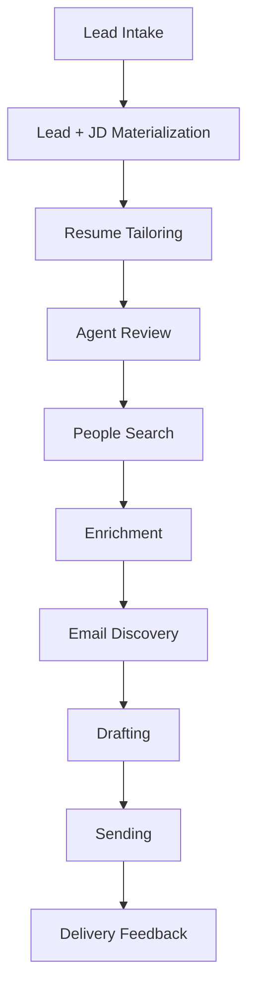
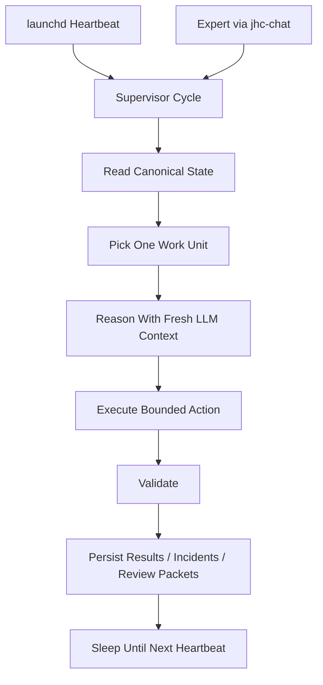
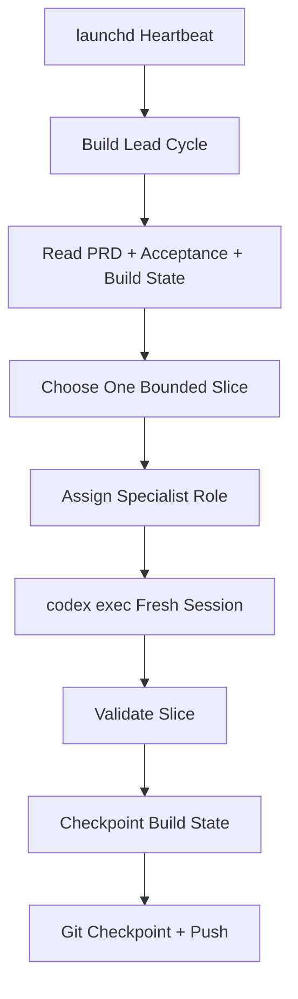
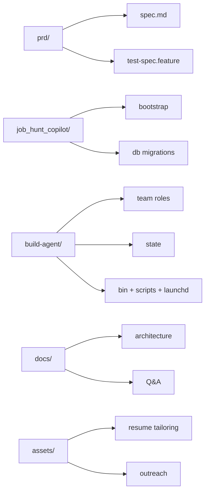

# Architecture Overview

This document is the quickest technical walkthrough of the repository.

For the full contract, see [prd/spec.md](../prd/spec.md).

## Big Picture

Job Hunt Copilot v4 is designed as two related systems:

1. the **product runtime**
   - ingests leads
   - tailors resumes
   - finds people
   - sends outreach
   - tracks delivery outcomes

2. the **control planes**
   - the **operations / supervisor agent** that runs the product
   - the **build agent** that helps implement the product itself

## Product Flow

## Runtime Control Plane

Key design choice:
- the LLM is not the memory
- SQLite state, artifacts, and logs are the memory

## Build Control Plane

Key design choice:
- the build team thinks in multiple roles
- unattended execution stays serialized by default
- one primary slice per cycle keeps repo changes understandable

## Data And Artifact Philosophy

This repository prefers:
- explicit artifacts over hidden memory
- state transitions over vague narrative progress
- machine-readable handoffs plus human-readable companion files

The product runtime now has an explicit bootstrap layer under `job_hunt_copilot/`:
- repo-path helpers for the current-build layout
- DB migration scaffolding for `job_hunt_copilot.db`
- bootstrap checks for assets and local secret materialization
- repo-local runtime directory creation for downstream components

Important artifact families:
- `lead-manifest.yaml`
- `meta.yaml`
- `people_search_result.json`
- `recipient_profile.json`
- `discovery_result.json`
- `send_result.json`
- `delivery_outcome.json`
- review packets and maintenance artifacts under `ops/`

## Repository Structure

## What To Read Next

- [README.md](../README.md) for the repo-level summary
- [prd/spec.md](../prd/spec.md) for the full system contract
- [build-agent/README.md](../build-agent/README.md) for the unattended build system
